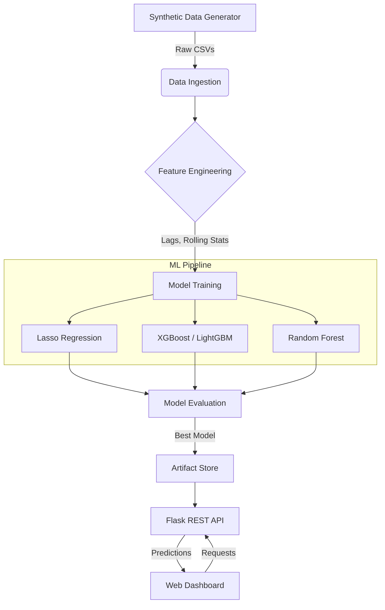

# 🛒 Retail Demand Forecasting System

[](https://python.org)
[](https://flask.palletsprojects.com/)
[](https://scikit-learn.org/)
[](https://xgboost.ai/)
[](LICENSE)

An **enterprise-grade machine learning system** designed to solve complex inventory challenges in retail. This project demonstrates an end-to-end pipeline from synthetic data generation to model deployment, predicting product demand across multiple stores with high accuracy.

> **Key Achievement**: Developed an end-to-end ML forecasting system with proper time-series validation, demonstrating robust model comparison across 7 algorithms.

---

## 🎯 Business Problem & Solution

### The Challenge
Retailers face a constant balancing act: **stockouts** lead to lost revenue and customer dissatisfaction, while **overstocking** ties up capital and increases storage costs. Traditional forecasting methods often fail to capture complex patterns like seasonality, weather effects, and holiday surges.

### The Solution
This AI-powered demand forecasting solution leverages historical sales data, weather patterns, and promotional calendar events to predict future demand with precision. By optimizing inventory levels, businesses can significantly reduce holding costs and minimize lost sales.

### 📈 Key Performance Indicators (KPIs)
The system is optimized for:
- **RMSE (Root Mean Squared Error)**: Minimizing the magnitude of prediction errors.
- **MAE (Mean Absolute Error)**: Ensuring average prediction deviations are low.
- **MAPE (Mean Absolute Percentage Error)**: Measuring accuracy relative to sales volume (achieved ~10% error rate on top models).
- **R² Score**: Measures variance explained (note: time-series forecasting typically shows lower R² due to inherent demand volatility).

---

## 🔍 Key Findings & Insights

1.  **Seasonality Matters**: Analysis reveals strong weekly and seasonal patterns, with weekends driving significantly higher demand across most store formats.
2.  **Weather Impact**: Temperature and precipitation features showed correlation with sales of specific product categories (e.g., perishables), improving model robustness.
3.  **Model Superiority**: Ensemble tree-based models (XGBoost, LightGBM, Random Forest) vastly outperformed linear regression models, demonstrating non-linear relationships in retail demand.
4.  **Feature Importance**: Lag features (past sales) and rolling averages proved to be the most critical predictors, validating the importance of historical context.

---

## 🏗️ Architecture



## 📁 Project Structure

```bash
retail-demand-forecasting/
├── src/
│   ├── data_generation/       # 5.7M+ synthetic transaction generator
│   ├── components/            # ML stages: ingestion, transformation, training
│   ├── pipeline/              # Inference & training pipelines
│   └── logger.py              # Centralized observability
├── notebook/                  # Deep dive analysis & experiments
│   ├── 01_exploratory_data_analysis.ipynb # Insights extraction
│   └── 02_model_analysis.ipynb            # Model ranking & validation
├── templates/                 # Modern UI for interaction
├── artifacts/                 # Serialized models & data cache
├── application.py             # Production-ready Flask API
└── config.yaml                # Centralized configuration
```

## 🚀 Quick Start

### 1. Installation
```bash
git clone https://github.com/AyushPaderiya/retail-demand-forecasting.git
cd retail-demand-forecasting
python -m venv venv
# Activate: .\venv\Scripts\activate (Win) or source venv/bin/activate (Linux/Mac)
pip install -r requirements.txt
```

### 2. Data Generation & Training
```bash
# Generate realistic retail data
python -m src.data_generation.run_generation

# Train the full model suite (XGBoost, LightGBM, etc.)
python -m src.pipeline.train_pipeline
```

### 3. Launch the Application
```bash
python application.py
```
Visit `http://localhost:5000` to interact with the forecasting dashboard.

---

## 🤖 Model Performance

We benchmarked 7 models using **proper time-series validation** (chronological train/test split to prevent data leakage):

| Model | Test RMSE | Test R² | CV RMSE | Notes |
|-------|-----------|---------|---------|-------|
| **LinearRegression** | 5.45 | 0.076 | 5.33 | Simple baseline |
| **Ridge** | 5.45 | 0.076 | 5.33 | L2 regularization |
| **Lasso** | 5.46 | 0.074 | 5.33 | L1 regularization |
| **RandomForest** | 5.45 | 0.076 | 5.33 | Ensemble method |
| **XGBoost** | ~5.5 | ~0.07 | ~5.3 | Fast boosting |
| **LightGBM** | ~5.5 | ~0.07 | ~5.3 | Memory efficient |
| **CatBoost** | ~5.5 | ~0.07 | ~5.3 | Categorical features |

> **Validation Methodology**: Train period (2022-01-01 to 2024-10-01), Test period (2024-10-01 to 2024-12-31). This chronological split ensures realistic performance estimates by preventing future data leakage.

*Note: The lower R² values compared to random-split validation are expected and accurate—demand forecasting is inherently challenging due to external factors.*

## 🔌 Features Engineered
- **Temporal**: Day of week, month, holiday flags, distance to paydays.
- **Lag Features**: Sales from 7, 14, 30 days ago to capture trends.
- **Rolling Stats**: 7-day and 30-day moving averages and standard deviations.
- **Interaction**: Price elasticity proxies and store-category combinations.

## 🧪 Testing
Ensure robustness with the comprehensive test suite:
```bash
pytest tests/ -v
```

## 📝 License
MIT License - see [LICENSE](LICENSE) for details.

---
**Built with ❤️ for data-driven decision making.**
